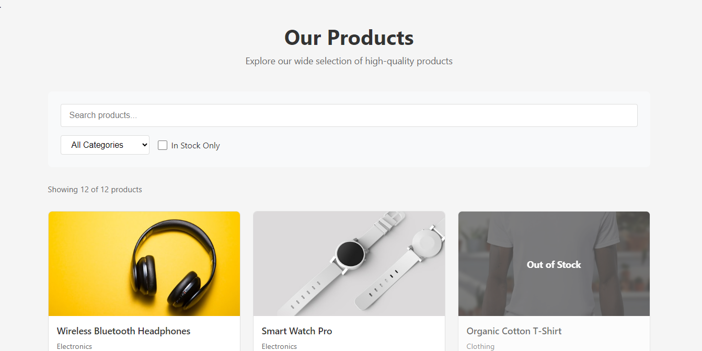

# Nx React E-Commerce Starter

[](https://github.com/adnenre/nx-starter-e-commerce/actions/workflows/ci.yml)

A production‑ready full‑stack e‑commerce starter built with Nx, React, Node.js, and pnpm.

<a alt="Nx logo" href="https://nx.dev" target="_blank" rel="noreferrer"></a>

A production‑ready React monorepo showcasing [Nx](https://nx.dev) with **pnpm workspaces**, module boundaries, and full‑stack development (React + Node.js API).

## Screenshot



> ✅ Built with Nx 22.7, React 19, Vite, Vitest, Playwright, and Express.

## 📦 Project Overview

| Type             | Name                               | Description                           |
| ---------------- | ---------------------------------- | ------------------------------------- |
| **Applications** | `shop`                             | React e‑commerce frontend (Vite)      |
|                  | `api`                              | Express backend (Node.js)             |
|                  | `shop-e2e`                         | Playwright end‑to‑end tests           |
| **Libraries**    | `@org/shop-feature-products`       | Product listing page (React)          |
|                  | `@org/shop-feature-product-detail` | Product detail page (React)           |
|                  | `@org/shop-data`                   | Data fetching & state management      |
|                  | `@org/shop-shared-ui`              | Reusable UI components (spinner etc.) |
|                  | `@org/api-products`                | Products service for the API          |
|                  | `@org/models`                      | Shared TypeScript models & types      |
|                  | `@org/shared-test-utils`           | Testing helpers for unit/e2e tests    |

All internal dependencies are linked via **pnpm workspaces** using the `workspace:*` protocol.

## 🚀 Quick Start

```bash
# Clone the repository
git clone https://github.com/adnenre/nx-starter-e-commerce.git
cd nx-starter-e-commerce

# Install dependencies (pnpm required)
pnpm install

# Serve the React shop application
pnpm nx serve shop
# → http://localhost:4200

# In a separate terminal, serve the backend API
pnpm nx serve api
# → http://localhost:3333

# Build all projects
pnpm nx run-many -t build

# Run tests everywhere
pnpm nx run-many -t test

# Lint all projects
pnpm nx run-many -t lint

# Run e2e tests
pnpm nx e2e shop-e2e

# Explore the project graph
pnpm nx graph
```

## ⭐ Featured Nx Capabilities

### 🔒 Module Boundaries (Tags)

Enforce architectural rules with custom tags. Each project declares its scope and type in `nx.json` tags.

| Project          | Tags                         | Can depend on                |
| ---------------- | ---------------------------- | ---------------------------- |
| `shop` (app)     | `scope:shop`                 | `scope:shop`, `scope:shared` |
| `api` (app)      | `scope:api`                  | `scope:api`, `scope:shared`  |
| `shop-feature-*` | `scope:shop`, `type:feature` | `scope:shop`, `scope:shared` |
| `shop-data`      | `scope:shop`, `type:data`    | `scope:shared`               |
| `shop-shared-ui` | `scope:shop`, `type:ui`      | `scope:shared`               |
| `api-products`   | `scope:api`                  | `scope:shared`               |
| `models`         | `scope:shared`, `type:data`  | None (base library)          |

Try violating a boundary – ESLint will catch it:

```bash
pnpm nx lint shop-feature-products
```

### 🎭 Playwright E2E Testing

End‑to‑end tests for the `shop` app are pre‑configured:

```bash
pnpm nx e2e shop-e2e
pnpm nx e2e-ci shop-e2e   # CI‑optimised
```

### ⚡ Vitest for Unit Testing

Fast unit testing with Vitest:

```bash
pnpm nx test shop-data
pnpm nx run-many -t test
```

### 🔧 Self‑Healing CI (Optional)

If you connect to Nx Cloud, `nx fix-ci` can automatically suggest fixes for common CI issues:

```bash
pnpm nx fix-ci
```

[Learn more →](https://nx.dev/ci/features/self-healing-ci)

## 📁 Project Structure

```bash
.
├── apps/
│   ├── shop/                 # React frontend (Vite)
│   ├── shop-e2e/             # Playwright tests
│   └── api/                  # Express backend (Node.js)
├── libs/
│   ├── shop/
│   │   ├── feature-products/     # Product list page
│   │   ├── feature-product-detail/ # Product detail page
│   │   ├── data/                 # API client & state
│   │   └── shared-ui/            # Reusable UI components
│   ├── api/
│   │   └── products/              # Product service library
│   └── shared/
│       ├── models/                # Shared TypeScript interfaces
│       └── test-utils/            # Testing helpers
├── pnpm-workspace.yaml        # pnpm workspace definition
├── nx.json                    # Nx configuration & plugins
├── tsconfig.base.json         # Base TypeScript config (paths, bundler)
└── eslint.config.mjs          # ESLint with module boundary rules
```

## 🛠️ Development Commands

```bash
# Start individual apps
pnpm nx serve shop          # React (port 4200)
pnpm nx serve api           # API (port 3333)

# Build specific project or all
pnpm nx build shop
pnpm nx run-many -t build

# Test & lint
pnpm nx test shop-data
pnpm nx lint api-products

# Affected commands (CI)
pnpm nx affected -t build --base=main
```

## ➕ Adding New Code

Generate new applications, libraries, or components with Nx generators:

```bash
# React app
pnpm nx g @nx/react:app my-new-app

# React library
pnpm nx g @nx/react:lib my-lib --directory=shared

# React component inside a library
pnpm nx g @nx/react:component Button --project=shop-shared-ui

# Node/Express library
pnpm nx g @nx/node:lib my-api-lib
```

> Always run `pnpm install` after generating libraries to update workspace symlinks.

## 🔗 pnpm Workspace Details

This repository uses **pnpm** for fast, disk‑efficient installs. The workspace is defined in `pnpm-workspace.yaml`:

```bash
packages:
  - 'apps/*'
  - 'libs/api/products'
  - 'libs/shared/*'
  - 'libs/shop/*'
```

All internal `@org/*` dependencies are declared with `"workspace:*"` in `package.json` files, ensuring pnpm links them locally instead of fetching from npm.

Example from `apps/api/package.json`:

```ts
"dependencies": {
  "express": "^4.21.2",
  "@org/api-products": "workspace:*",
  "@org/models": "workspace:*"
}
```

## ☁️ Nx Cloud

Nx Cloud provides remote caching and distributed task execution for faster CI. [Connect your workspace](https://cloud.nx.app/setup/connect-workspace/guide) to enable:

- Remote caching of build/test outputs
- Task distribution across multiple machines
- Automatic e2e test splitting
- Flaky task detection and rerunning

## 📚 Learn More

- [Nx Documentation](https://nx.dev)
- [React Monorepo Tutorial](https://nx.dev/getting-started/tutorials/react-monorepo-tutorial)
- [Module Boundaries](https://nx.dev/features/enforce-module-boundaries)
- [Playwright with Nx](https://nx.dev/technologies/test-tools/playwright/introduction)
- [Vite + React](https://nx.dev/recipes/vite)
- [pnpm Workspaces](https://pnpm.io/workspaces)
